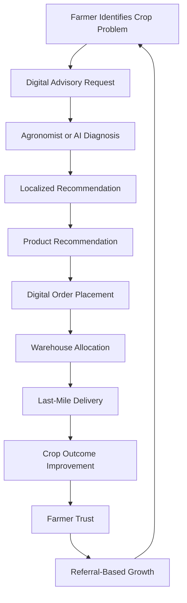
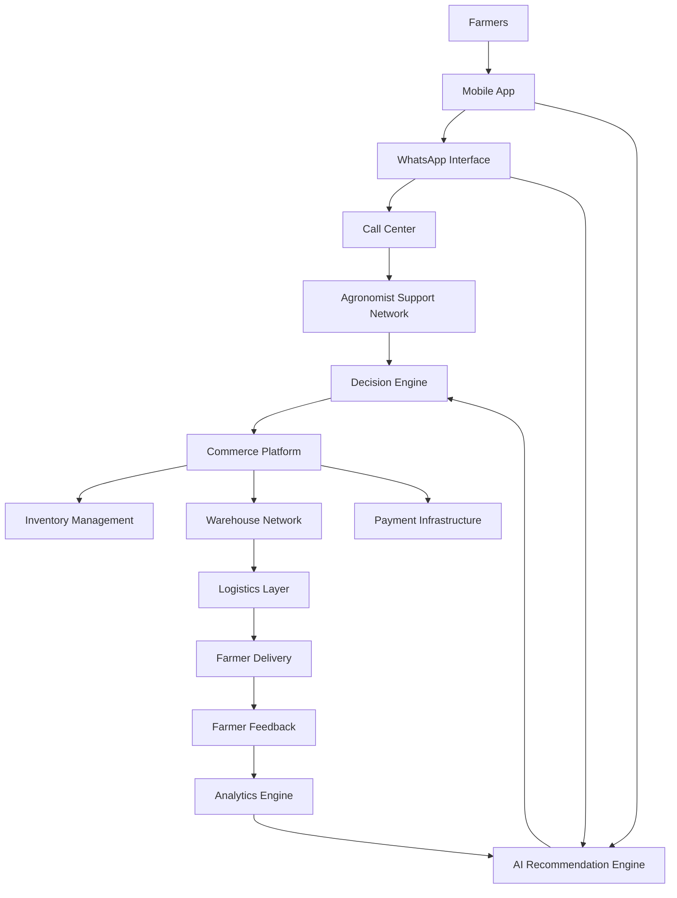

# AgroStar Business Model, Market Study & Gap Analysis

## AI-Driven Agricultural Commerce and Advisory Platform Analysis

---

# Overview

This repository presents a detailed strategic and operational analysis of AgroStar, one of India’s leading agri-tech platforms focused on transforming agricultural input distribution through digital advisory systems, supply-chain optimization, and data-driven farmer engagement.

The study examines:

- Agricultural supply-chain inefficiencies
- Farmer behavioral and economic challenges
- AgroStar’s advisory-commerce integration model
- Hyperlocal logistics systems
- Competitive positioning
- Regulatory constraints
- Technology-driven agricultural ecosystems
- Strategic growth opportunities

The analysis integrates business strategy, operational modeling, financial reasoning, and digital platform architecture to evaluate how AgroStar modernizes agricultural commerce at scale.

---

# Industry Problem Statement

Traditional agricultural distribution systems in India involve multiple intermediaries, resulting in:

- High distribution inefficiencies
- Counterfeit product circulation
- Weak farmer advisory support
- Poor product traceability
- Delayed delivery cycles
- Low transparency across supply chains

Traditional agricultural supply chain:


Operational consequences include:

- Increased farmer acquisition costs
- Reduced trust in input quality
- Information asymmetry
- Fragmented rural distribution
- Low advisory reliability

---

# Market and Farmer Pain Point Analysis

## Primary Challenges Identified

| Challenge | Impact |
|---|---|
| Incorrect crop advisory | Reduced productivity |
| Counterfeit agricultural inputs | Financial losses |
| Delayed procurement | Crop-cycle disruptions |
| Limited expert accessibility | Poor decision-making |
| High pricing inefficiencies | Reduced farmer margins |
| Weak logistics infrastructure | Delivery uncertainty |
| Limited digital penetration | Platform adoption barriers |

---

# AgroStar Strategic Model

AgroStar operates on a trust-driven advisory-commerce framework where agronomic intelligence acts as the primary acquisition and retention mechanism.

Core strategic pillars:

- Digital agronomy advisory
- AI-assisted recommendation systems
- Integrated agricultural commerce
- Hyperlocal fulfillment infrastructure
- Relationship-driven farmer retention
- Data-centric operational intelligence

---

# Content-to-Commerce Operational Flywheel



---

# Core Business Logic

AgroStar differentiates itself through advisory-led commerce rather than price-based competition.

Strategic transformation:

```text
Transactional Agricultural Retail
                    ↓
Relationship-Centric Agricultural Intelligence Platform
```

The model focuses on:

- Long-term farmer retention
- Advisory credibility
- Outcome-based trust generation
- Reduced customer acquisition costs
- Recurring seasonal engagement

---

# Platform System Architecture



---

# Operational Components

## Advisory Layer

- Agronomist-assisted consultation
- AI-powered crop diagnostics
- Multilingual advisory systems
- Crop lifecycle guidance

## Commerce Layer

- Agricultural input marketplace
- Product recommendation systems
- Order management systems
- Digital payment integration

## Logistics Layer

- Hyperlocal warehousing
- Inventory optimization
- Last-mile rural delivery
- Delivery-time optimization

## Analytics Layer

- Farmer behavioral analysis
- Product demand forecasting
- Recommendation optimization
- Operational KPI monitoring

---

# Competitive Landscape

| Segment | Strength | Limitation |
|---|---|---|
| Traditional Retailers | Local relationships | Low transparency |
| Generic E-Commerce | Scale and pricing | Weak advisory support |
| Input-Focused AgriTech | Faster fulfillment | Limited ecosystem depth |
| Full-Stack Agri Platforms | Integrated lifecycle management | High operational complexity |

---

# Regulatory and Compliance Constraints

The agricultural input ecosystem in India is heavily regulated under multiple legal frameworks:

- Insecticides Act, 1968
- Seed Act, 1966
- Essential Commodities Act
- Fertilizer subsidy regulations
- State licensing frameworks

Operational implications include:

- Licensing requirements
- Product certification obligations
- Inventory compliance controls
- Distribution restrictions
- Documentation and audit requirements

---

# Strategic Challenges

## Market-Level Constraints

- Fragmented land holdings
- Low transaction value density
- Rural infrastructure gaps
- Digital literacy limitations
- Seasonal purchasing variability

## Operational Constraints

- Inventory forecasting complexity
- Supply-chain scalability
- Rural logistics optimization
- Advisory standardization
- Regulatory overhead

---

# Data and AI Opportunities

Potential technology expansion areas include:

- Predictive pest detection
- Precision agriculture systems
- Satellite-driven crop intelligence
- Yield forecasting models
- AI-based agronomic recommendations
- Demand prediction engines
- Personalized farmer intelligence systems

---

# Key Performance Metrics

| KPI | Strategic Relevance |
|---|---|
| Customer Acquisition Cost | Growth efficiency |
| Farmer Retention Rate | Trust and engagement |
| Average Order Value | Revenue optimization |
| Advisory Conversion Rate | Commerce effectiveness |
| Delivery Turnaround Time | Operational efficiency |
| Repeat Purchase Frequency | Farmer lifecycle strength |
| Gross Margin | Business sustainability |

---

# Strategic Insights

AgroStar’s competitive advantage is created through the integration of:

```text
Advisory Intelligence
        +
Digital Commerce
        +
Hyperlocal Logistics
        +
Farmer Trust
        +
Data Network Effects
```

The platform’s defensibility increases with:

- Farmer interaction density
- Advisory data accumulation
- Supply-chain optimization
- Recommendation accuracy
- Ecosystem integration depth

---

# Research Domains Covered

- AgriTech Business Models
- Agricultural Supply Chains
- Rural Commerce Systems
- AI in Agriculture
- Platform Economics
- Logistics Optimization
- Digital Advisory Systems
- Strategic Market Analysis
- Operational Intelligence
- Agricultural Technology Ecosystems

---

# Conclusion

AgroStar represents a scalable agricultural intelligence and commerce platform that combines advisory systems, logistics infrastructure, and digital operations to address structural inefficiencies in Indian agriculture.

Its long-term strategic advantage lies not only in product distribution but in building a data-rich, trust-driven agricultural ecosystem capable of supporting scalable rural digital transformation.

---
