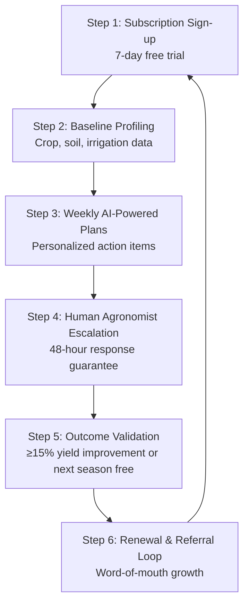
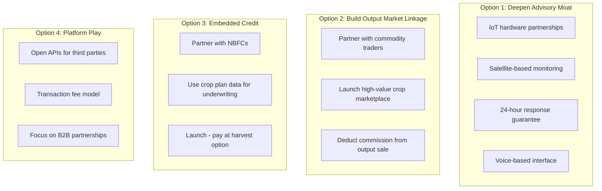

# BharatAgri: Precision Agronomy as the Future of Indian Farming

## AI-Driven Subscription-Based Agricultural Advisory Platform Analysis

---

# Overview

BharatAgri is a leading Indian agritech platform that has disrupted traditional agricultural extension services through a subscription-based precision agronomy model. The company serves **1.2+ million paid subscribers** across 9 Indian states, generates **₹180 crore in annual recurring revenue (ARR)**, and has built a proprietary AI agronomy engine processing **500,000+ crop queries per month**.

---

# Industry Problem Statement

Traditional agricultural advisory in India operates through three flawed channels:

| Channel | Reach | Accuracy | Key Issue |
|---------|-------|----------|-----------|
| Government Extension (KVK) | 15% | 40% | 1:10,000 officer-farmer ratio |
| Input Retailer Advice | 68% | 35% | Biased toward high-margin products |
| Peer Networks | 55% | 45% | Small sample sizes, confirmation bias |

**Consequence:** Up to 30% of input expenditure (₹25,000-40,000 per hectare) is wasted due to incorrect recommendations, counterfeit products, and absence of continuous support.

---

# Farmer Pain Point Analysis (N=5,000 Survey)

| Pain Point | % Reporting | Severity (1-10) |
|------------|-------------|-----------------|
| No follow-up advice after purchase | 73% | 9.1 |
| Wrong pest/disease diagnosis | 68% | 8.7 |
| Counterfeit products | 61% | 8.8 |
| No personalized crop calendar | 64% | 7.9 |
| No access to qualified agronomists | 51% | 8.2 |
| Uncertainty about application timing | 58% | 7.6 |

---

# Precision Agronomy Flywheel

# Revenue Architecture

## Three-Tier Revenue Model

| Stream | Contribution | Gross Margin | Key Partners/Customers |
|--------|--------------|--------------|------------------------|
| B2C Subscription Fees | 65-70% | 70-80% | Direct farmer payments |
| B2B Data & Insights | 15-20% | 60-70% | Bayer, Syngenta, UPL, Olam, Cargill, insurance companies |
| Input Fulfillment Commission | 10-15% | 5-12% | Local retailers, e-commerce platforms |

## Subscription Pricing

| Crop Type | Price Range (per season) | Examples |
|-----------|-------------------------|----------|
| Short-duration crops | ₹999 - ₹1,299 | Groundnut, pulses, vegetables |
| Medium-duration crops | ₹1,499 - ₹1,899 | Cotton, soybean, maize |
| Long-duration crops | ₹2,199 - ₹2,499 | Sugarcane, banana, grapes |
| Annual plan (multiple crops) | ₹3,999 - ₹4,999 | Mixed cropping farmers |

---

# Unit Economics (FY2026 Estimates)

| Metric | Value | Notes |
|--------|-------|-------|
| Customer Acquisition Cost (CAC) | ₹1,000 - ₹1,400 | Digital ads, referrals, field agents |
| Average Subscription Value | ₹1,500/season | Two seasons per year typical |
| Annual Revenue per Subscriber | ₹3,000 | - |
| Gross Margin | 72% | - |
| Gross Profit per Subscriber/Year | ₹2,160 | - |
| 12-Month Renewal Rate | 68% | Industry-leading |
| 36-Month Renewal Rate | 42% | - |
| Average Customer Lifespan | 3.2 years | - |
| Customer Lifetime Value (LTV) | ₹6,900 | 2,160 × 3.2 |
| LTV:CAC Ratio | 5.5:1 – 6.9:1 | Healthy by SaaS standards |
| Payback Period | 5–6 months | Time to recover CAC |

---

# Financial Performance (FY2022-FY2026)

| Fiscal Year | Paid Subscribers (M) | ARR (Cr) | YoY Growth | Gross Margin | Operating Margin |
|-------------|---------------------|----------|------------|--------------|------------------|
| FY2022 | 0.25 | 35 | — | 68% | -45% |
| FY2023 | 0.48 | 68 | 94% | 70% | -35% |
| FY2024 | 0.75 | 108 | 59% | 71% | -18% |
| FY2025 | 1.02 | 150 | 39% | 72% | -5% |
| FY2026 (est) | 1.25 | 185 | 23% | 72% | +8% |

## Operating Expense Breakdown

| Expense Category | % of Revenue | Details |
|-----------------|--------------|---------|
| Product & Engineering | 30% | 200+ engineers and data scientists |
| Sales & Marketing | 25% | Digital advertising, field agents |
| Agronomist Team | 15% | 150+ in-house agronomists |
| General & Administrative | 10% | Operations and overhead |

---

# Technology Stack

| Component | Description | Capability |
|-----------|-------------|------------|
| Crop Knowledge Graph | Structured database of crop-pest-product interactions | 200+ crops, 1,500+ varieties, 5,000+ pests, 10,000+ products |
| Image Recognition Engine | Deep learning model for pest/disease diagnosis | 85% top-3 accuracy, 5M+ labeled training images |
| Pest & Disease Forecasting | Time series models integrating weather APIs | Proactive outbreak alerts to farmers |
| Personalization Engine | Digital twin for each subscriber | Dynamic soil, crop stage, microclimate models |
| Farmer Relationship Management (FRM) | Complete interaction tracking | Enables increasingly personalized recommendations |

---

# Competitive Landscape

## Strategic Comparison (1 = Poor, 5 = Excellent)

| Dimension | BharatAgri | DeHaat | Plantix | Fasal |
|-----------|------------|--------|---------|-------|
| Advisory accuracy | 5 | 3 | 4 | 4 |
| Advisory personalization | 5 | 2 | 2 | 4 |
| Input fulfillment | 2 | 5 | 1 | 2 |
| Output market linkage | 1 | 5 | 1 | 1 |
| Credit access | 1 | 3 | 1 | 1 |
| Hardware/IoT integration | 2 | 1 | 1 | 5 |
| Subscription revenue recurring | 5 | 2 | 1 | 3 |
| Gross margin sustainability | 5 | 2 | 3 | 2 |

## Key Differentiators

1. Paid subscription creates commitment and reduces churn
2. Weekly personalized plans rather than one-off advice
3. Measurable 15% yield improvement guarantee

---

# Gap Analysis

## Product Portfolio Gaps

| Gap | Description | Impact |
|-----|-------------|--------|
| No Output Market Linkage | Helps farmers grow more but doesn't help sell | Farmers accept below-market prices |
| No Embedded Credit | No financing options at season start | Farmers borrow from retailers instead |
| Limited Hardware Integration | Software-only model | No real-time field data from sensors |
| No On-Farm Services | No application or demonstration services | Limited farmer support and training |

## Service Delivery Gaps

| Gap | Description | Impact |
|-----|-------------|--------|
| Response Time Variability | 48-hour guarantee extends to 72-96 hours during peak pest seasons | Rapidly spreading pests can cause crop loss |
| Language Coverage | Supports only 6 languages | Eastern Indian languages not covered |
| Offline Access Limitations | App requires connectivity for plans and uploads | Limited use in poor connectivity areas |

## Geographic Coverage Gaps

| Region | Cropping Pattern | Current Penetration |
|--------|-----------------|---------------------|
| Eastern India (West Bengal, Bihar, Odisha) | Rice, jute, vegetables | Not served |
| Central India (Madhya Pradesh, Chhattisgarh) | Soybean, wheat, pulses | Low |
| Northern India (Punjab, Haryana, UP) | Wheat, rice, sugarcane | Pilot only |
| Northeast India | Rice, tea, horticulture | Not served |
| Rajasthan | Pearl millet, mustard, cumin | Not served |

---

# Strategic Recommendations

## Four Strategic Options

# Recommended: Phased Hybrid Approach (24-Month Roadmap)

| Phase | Timeline | Key Actions |
|-------|----------|-------------|
| Phase 1 | Months 1-6 | Launch output linkage pilot with 2 commodity traders in Maharashtra; Expand language support to Bengali and Odia; Reduce agronomist response time to 24-hour guarantee |
| Phase 2 | Months 7-12 | Partner with NBFC for subscription financing; Launch "pay at harvest" for pilot farmers; Enter Madhya Pradesh and Punjab markets; Pilot IoT sensors with 5,000 premium subscribers |
| Phase 3 | Months 13-18 | Scale output linkage to 5 states; Launch high-value crop marketplace; Integrate satellite-based NDVI monitoring |
| Phase 4 | Months 19-24 | Evaluate platform API strategy; Consider strategic acquisition of IoT startup; Target 2.5M subscribers and ₹400 Cr ARR |

---

# Key Metrics Summary

| KPI | Value | Strategic Relevance |
|-----|-------|---------------------|
| Paid Subscribers | 1.25M | Scale and market reach |
| Annual Recurring Revenue | ₹180 Cr | Revenue predictability |
| Gross Margin | 72% | Business sustainability |
| Customer Renewal Rate | 68% | Farmer trust and engagement |
| LTV:CAC Ratio | 6:1 | Growth efficiency |
| Operating Margin | +8% | Path to profitability achieved |
| AI Diagnostic Accuracy | 85% | Advisory quality |
| Agronomist Team Size | 150+ | Human-in-the-loop support |

---

# Strategic Insights

## Competitive Advantage Formula

| Component | Description |
|-----------|-------------|
| + | Advisory Intelligence (AI + 150+ Human Agronomists) |
| + | Subscription-First Business Model |
| + | 15% Yield Improvement Guarantee |
| + | Weekly Personalized Plans |
| + | Data Network Effects (1.2M+ subscribers) |
| **=** | **Defensible Precision Agronomy Platform** |

text

## Platform Defensibility Increases With

- Farmer interaction density (weekly engagement)
- Advisory data accumulation (500K+ monthly queries)
- AI model accuracy improvements
- Renewal rate growth (68% and increasing)
- Geographic expansion (9 states currently)
- B2B data partnerships (Bayer, Syngenta, UPL, Olam, Cargill)

---

# Conclusion

BharatAgri has successfully built a differentiated agritech business model based on a simple but powerful insight: **Farmers will pay for advice that is personalized, continuous, and accountable.**

The precision agronomy flywheel, supported by a robust AI engine and qualified agronomists, has created real value for over 1.2 million paying subscribers. Unit economics are healthy (LTV:CAC > 5:1), and the company achieved operating profitability in FY2026.

The strategic question moving forward is whether to:

- Double down on advisory excellence (Option 1)
- Expand into adjacent services like output and credit (Options 2 & 3)
- Pivot to a platform model (Option 4)

The recommended path is a **phased hybrid approach** that strengthens the core advisory moat while systematically building output and credit capabilities, balancing operational complexity with strategic ambition.

For the farmer, the ultimate measure remains unchanged: **increased net income per acre.** Building a complete operating system for Indian agriculture is the next frontier.

---

# Key Takeaways

1. **Subscription-first model works in agriculture** - 1.2M+ paid subscribers prove willingness to pay for quality advice
2. **Trust is the ultimate currency** - 15% yield guarantee and 68% renewal rate demonstrate outcome-based trust
3. **High-margin, asset-light approach** - 72% gross margins with no inventory or logistics overhead
4. **Data network effects are defensible** - Each farmer improves AI models for all farmers
5. **Gaps represent growth opportunities** - Output linkage, credit, and IoT are adjacent expansions
6. **Path to profitability achieved** - Operating margin positive in FY2026 (+8%)
